# grianghraf - Project 5

<h1> A B2C Digital Camera Store Website </h1>

<h2> align=center>Introduction</h2>

<p>Project Portfolio 5 for the Code Institute Full-Stack development program: E-Commerce Applications.</p> 

<p>grianghraf is an e-commerce online store application built with Django and Python. It allows users to create their own accounts, and experience a full online shopping experience whereby they can purchase items of cameras and lenses. The application is for a B2C business, that is targeted towards professional photographers and filmakers but also people looking to get into photography. <br>
This online sales platform allows users to quickly find the camera they are looking for and checkout with a seamless experience. They can also register for a personal profile by filling in their personal details on the website's profile page. The application also provides customer enagement by allowing the user to rate and review the products they have purchased. The application has a good appearance with an easy and clear site navigation.</p>

[Visit the live site on Heroku](https://grianghraf.herokuapp.com/)


README Table Content

- [grianghraf - Introduction](#watches--clocks---introduction)
  - [User Experience - UX](#user-experience---ux)
    - [User Stories](#user-stories)
    - [Agile Methodology](#agile-methodology)
    - [The Scope](#the-scope)
      - [Main Site Goals](#main-site-goals)
  - [Design](#design)
      - [Colours](#colours)
      - [Typography](#typography)
      - [Imagery](#imagery)
      - [Video](#video)
    - [Wireframes](#wireframes)
  - [Database Diagram](#database-diagram)
  - [Features](#features)
    - [Landing Page](#landing-page)
    - [Home Page - Images Carousel](#home-page---images-carousel)
    - [Home Page - Selected Products](#home-page---selected-products)
    - [Home Page - Image Banner](#home-page---image-banner)
    - [Home Page - Customers Reviews Carousel](#home-page---customers-reviews-carousel)
    - [Products Page](#products-page)
    - [Products Details](#products-details)
    - [Products Details - Features](#products-details---features)
    - [Products Details - Products on Sale](#products-details---products-on-sale)
    - [Products Shopping Bag](#products-shopping-bag)
    - [Products Shopping Bag - Products Coming Soon](#products-shopping-bag---products-coming-soon)
    - [Products Checkout](#products-checkout)
    - [Products Checkout - Success](#products-checkout---success)
    - [Products Management](#products-management)
    - [Profile Page](#profile-page)
      - [Service Reviews Page](#service-reviews-page)
      - [Add/Edit Service Review Page](#addedit-service-review-page)
    - [Signup Page](#signup-page)
    - [Signup Page - Verify Email](#signup-page---verify-email)
    - [Signup Page - Confirm Email](#signup-page---confirm-email)
    - [Login Page](#login-page)
    - [Logout Page](#logout-page)
    - [Reset Password Page](#reset-password-page)
    - [Change Password Page](#change-password-page)
    - [Navbar](#navbar)
    - [Footer](#footer)
    - [Page 404 - Page Not Found](#page-404---page-not-found)
  - [Messages and Interaction with Users](#messages-and-interaction-with-users)
    - [Sign up 1](#sign-up-1)
    - [Sign up 2](#sign-up-2)
    - [Login](#login)
    - [Logout](#logout)
    - [Profile Update](#profile-update)
    - [Service Review - Add Review](#service-review---add-review)
    - [Service Review - Update Review 1](#service-review---update-review-1)
    - [Service Review - Update Review 2](#service-review---update-review-2)
    - [Service Review - Delete Review 1](#service-review---delete-review-1)
    - [Service Review - Delete Review 2](#service-review---delete-review-2)
    - [Service Review - Delete Review 3](#service-review---delete-review-3)
    - [Add Product](#add-product)
    - [Edit Product 1](#edit-product-1)
    - [Edit Product 2](#edit-product-2)
    - [Edit Product 3](#edit-product-3)
    - [Delete Product 1](#delete-product-1)
    - [Delete Product 2](#delete-product-2)
    - [Delete Product 3](#delete-product-3)
    - [Add Product to Bag](#add-product-to-bag)
    - [Update Bag](#update-bag)
    - [Remove Product from Bag](#remove-product-from-bag)
    - [Purchase Success](#purchase-success)
    - [Purchase Success - Confirmation Email](#purchase-success---confirmation-email)
  - [Admin Panel / Superuser](#admin-panel--superuser)
  - [Marketing and Social Media](#marketing-and-social-media)
    - [Statista - Facebook Users](#statista---facebook-users)
    - [Watches \& Clocks - Facebook Page](#watches--clocks---facebook-page)
    - [Meta Pixel - Tracking Audience](#meta-pixel---tracking-audience)
    - [Mailchimp Subscription Service](#mailchimp-subscription-service)
  - [Privacy Policy](#privacy-policy)
  - [Search Engine Optimization](#search-engine-optimization)
    - [sitemap.xml](#sitemapxml)
    - [robots.txt](#robotstxt)
    - [Sitemap Google Registration](#sitemap-google-registration)
  - [AWS Setup Process](#aws-setup-process)
    - [AWS S3 Bucket](#aws-s3-bucket)
    - [IAM Set Up](#iam-set-up)
    - [Connecting AWS to the Project](#connecting-aws-to-the-project)
  - [Stripe Payments](#stripe-payments)
    - [Payments](#payments)
    - [Webhooks](#webhooks)
  - [Technologies Used](#technologies-used)
    - [Languages Used](#languages-used)
    - [Django Packages](#django-packages)
    - [Frameworks - Libraries - Programs Used](#frameworks---libraries---programs-used)
    - [Testing](#testing)
  - [Creating the Django app](#creating-the-django-app)
  - [Deployment of This Project](#deployment-of-this-project)
  - [Final Deployment](#final-deployment)
  - [Forking This Project](#forking-this-project)
  - [Cloning This Project](#cloning-this-project)
  - [Credits](#credits)
    - [Content](#content)
    - [Information Sources / Resources](#information-sources--resources)
  - [Special Thanks](#special-thanks)


## User Experience- UX 

## The Strategy Plane
<hr>

### Concept 

This project was created as part of the [Code Institute's](https://codeinstitute.net/) Diploma in Full-Stack Software Development. The project aims to create a full-stack website that will show the skills I have gained in HTML, CSS and Javascript. 

The main purpose of this website is to provide a platform for like-minded coffee connoisseurs who are looking for inspiration to brew the best coffee they can while being able to create and add their own recipes. A SuperUser will be able to approve, edit and delete user recipes in order to manage the content on the website. The target audience for this website is anyone interested in speciality coffee from home coffee drinkers to professional baristas. There are so many variables to creating the perfect cup of coffee from the origin of the wholebeans used, brewing device and technique, and even the type of water used. This website is to be used almost like a diary and guide for coffee lovers. 

<h3>Site goals</h3>

* Create a platform that allows users to post their favourite coffee and share their thoughts through comments and likes under posts. 
* The website is designed to be intuitive and easy to navigate. 
* The website was designed to be responsive and to meet all screen sizes. 
* The website should focus on the display of the posts/recipes and present them in a convenient way that is easy to follow while you make your coffee. 
* The website should appeal to both at-home coffee drinkers but also professional baristas acting as a coffee community hub. 

### User Stories

<strong>As a website user, I can: </strong>

* Navigate around the site and easily view desired content. 
* View a list of products and choose them. 
* Search products to find a specific one 
* Click on a product to view further details 
* Register for an account to avail of member services. 
* View product ratings to get an idea of what the admin thinks of it. 
* View reviews for each product to get an idea of what past customers think. 


<strong>As registered user, I can:</strong>

* Review the website service and its cameras. 
* Delete my previous reviews.
* Save my data under my personal profile. 
* Edit my previous reviews. 
* Manage my profile by updating my details. 
* Logout of the website. 
* Checkout easier by using personal profile. 
* Sign up to the newsletter

<strong>As a SuperUser, I can:</strong>

* Create and publish a new product 
* Create a draft of a new product to finish later 
* Create a new user, products and categories. 
* Delete userm products, categories and reviews. 
* Approve user's reviews. 
* Change a user's permissions on the webiste. 
* Have access to the backend django admin system. 


<strong>Agile Methodology</strong>

I managed this project's functions and development through GitHubs projects Kanban board. Each user story was submitted as an issue, and as I finished a sprint of work I then moved across the board from Todo, to In Progress, to Done as required. Some of the issues were flagged as Bugs, and returned to once these bugs were resolved. 

[grianghraf - USER STORIES](https://github.com/users/AdamVictory/projects/3)

<h3>Scope</h3>

#### Main Site Goals

* The website should be functional, easy to navigate and intuitive. 
* The front end should present the content clearly. Visually appealing. 
* Users to manipulate their content (CRUD). 
* Allow logged in users to interact with other posts through comments. 
* Search - all users can use the search bar to quickly find products. 
* Comments and Likes - Users can comment and like other posts. 
* Users can sign in and sign out to view the website from different perspectives. Also can register for an account. 
* Custom 404 page for good UI. 
* Use bootstrap to make the site responsive, and custom CSS and Javascript. 
* Create a webpage application using the Django framework. 
* Provide users a good website experience with cameras and lenses. 
* Provide a website with a clear purpose. 
* Provide a website that allows the business to market themselves. 
* Provude users tools that allows them to search for products. 
* Provide users with a safe way of checking out using Stripe. 


## The Structure Plane 
<hr>

<p>Grianghraf, will have four pages for first-time users.</p>

  * Home page, Coffees, Register, Login, 

<p>Users without an account can navigate through these four pages and will be able to see the details of each coffee recipe. However, they will not be bale to sign up to our newsletter until they have made an account. This is to ensure that our newsletter goes out to those who really value the brand. 

When the user creates an account and is logged in, the following pages will be displayed.</p>

* Home page, Coffees, Logout and My Recipes. 

<p>Logged in users will be able to access all of the website pages. They can access all the details of each recipe while being able to interact with them. 
They will also be able to access all of their recipes, add new posts, edit old posts or delete them.</p>


## The Structure Plane 
<hr>

## Functional Scope 

### Flowchart 

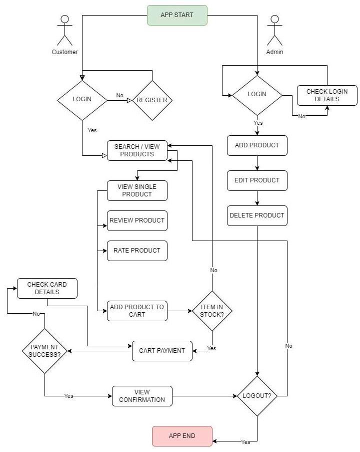

## Database Schema 

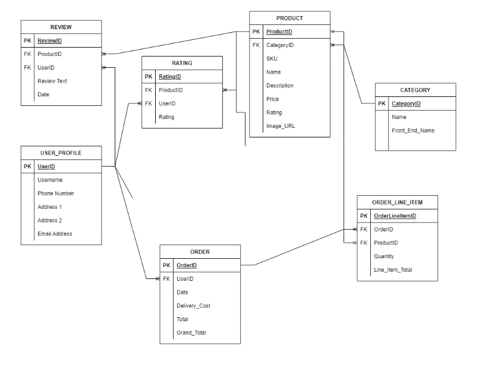


## The Skeleton Plane

## Wireframes 

I created the wireframe using [Figma](https://www.figma.com/)

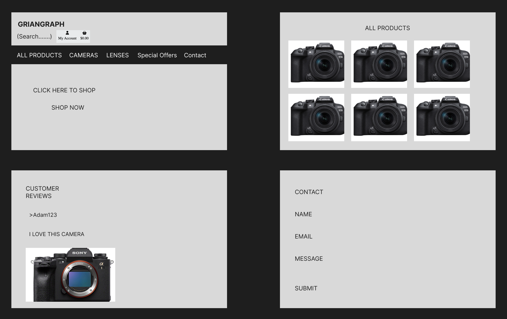

## The Surface Plane


## Design 

### Color Scheme 


I kept the colour scheme simple for this project as i didn't want to distract the user too much and wanted the focus to on the cameras themselves as the images for the cameras look so good. I intentionally chose black and white for the colour scheme to allow all of the focus to be on the camera imagery. 

All colours were generated by using [imagecolorpicker.com](https://imagecolorpicker.com/en). 

### Typography 

Two fonts are used throughout this website. I got them from [Google Fonts](https://fonts.google.comn/). 
The font family for this project was: 'Sofia Sans', sans-serif; . I wanted to keep the font very simple and easy to read as there will be a lot of text within each coffee recipe. 


### Imagery 

I used [Conns Cameras](https://connscameras.ie/) to source the camer and lens imagery for this project. 

## Features 

## Base Template
The base template provides a structure to the application in that it holds the 2 main features of the application that are common to all views, the header and footer sections. A "base.html" file was created in Django to hold these elements, and also contain the various css and javascript links and files needed for inital loading of the application.

## Header Section

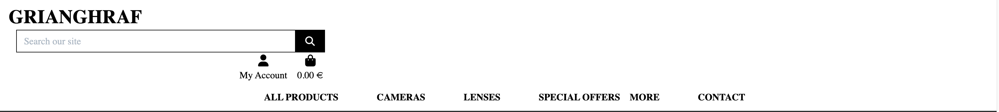

The header section consists of 4 elements, a logo which stacks to the upper left, a search bar which appears on upper center, and an icon menu which contains the links for logging in/out, wishlist and cart. Underneath this section there is a second row which houses the main bootstrap menu for the product, the various links allowing the user to search products by price, by category and so on. Just below the header section is an information bar, showing the current logged in users email and a message about free postage.

## Banner Section

The banner section consists of a call to action button which allows the user to be taken straight to the all products section. This is a key element of the e-commerce website as it provides a direct path to the products on website allowing for an easier e-commerce experience and leading to more sales. I wanted to keep this as simple and clear as possible to all the emphasis is on the button. 


## Footer Section

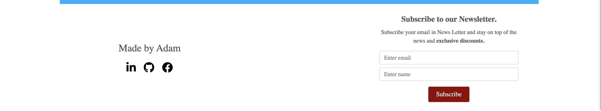

The footer provides the user with links to our facebook social media account. It allow allows signed in users to subscribe to our newsletter. I wanted to only have it visible to signed in users to ensure the newsletter was sent to people who actually wanted to receive it. 


![Navigation Bar General Users]


### Navigation Bar 

There are three different navigation bars: 

* Navigation Bar 1 - General Users

This navbar gives the general user the choice to see the homepage, view all coffee recipes, log in or sign up. They can also use the search bar. 


* Navigation Bar 2 - Registered Users

This navbar shows links to Add recipe, My recipes and Logout. 


* Navigation Bar 3 - Super User

This nav bar is for the super user. There is an additional link that allows them to approve, edit or delete recipes. 


### Banner


### Future features 

* A social media element to the website similar to instagram where the users would have a profile and can post even more pictures while having followers. 

### Purchase Success

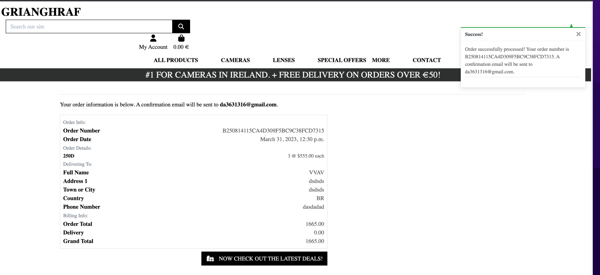

- When users fill out the check-out form and complete the purchase they will see a success message
  with the order details at the top right of the screen.<br>


## Admin Panel / Superuser

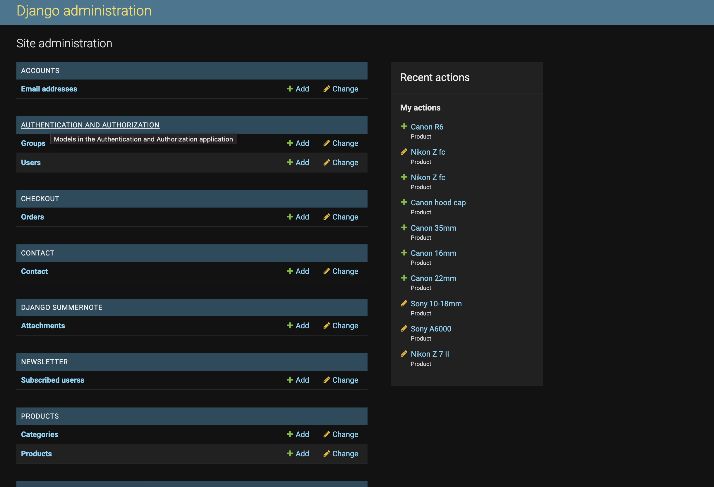

- On the Admin Panel and as an admin/superuser I have full access to CRUD functionality. This means I can view, create, edit and
  delete the following apps:

1. Orders
2. Checkout
3. Products
4. Profiles
5. Reviews
6. Contact
7. Newsletter

- As admin/superuser I can also approve reviews, change the status and give other permissions.<br>


## Marketing and Social Media

- Market research was undertaken to decide on the appropriate marketing strategy to promote this camera brand. For social media marketing,
Facebook is still the best option to promote brands to potential customers. It is one of the most used social media platforms with 22% of users
aged between 18 - 24 and 31% of users aged between 25 - 34. This age category is the main target audience for grianghraf. 
This age range is viewed as the most likely to become potential customers.<br>


### Watches & Clocks - Facebook Page

Facebook would not allow me to make a business profile so here is a mockup of what it would look like. 

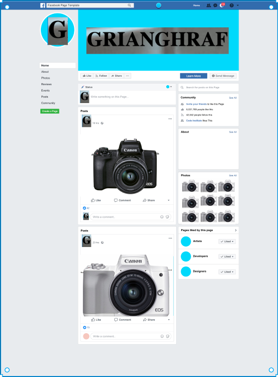<br>


## Privacy Policy

- In order to add a page with the grianghraf Privacy Policy I used the service [Privacy Policy Generator](https://www.privacypolicygenerator.info/) to ensure that the website is compliant with the European Privacy Policy Rules.<br>

[grianghraf - Privacy Policy Page](https://www.privacypolicygenerator.info/live.php?token=4mQX09cE1I04wjHRNdlZinuHWvRCNktY)<br>

## Search Engine Optimization

- The site was optimized by careful selection of keywords relating to the "world" of cameras. The chosen topics/words are based on my initial understanding of the business. Keywords were chosen based on common topics and themes within the industry. Topics and keywords were then tested tried out on Google and the relevantreturned search suggestions it gave were added to the keyword list.

The following are the keywords: 

        content="Sale of new digital cameras in Ireland, grianghraf is the lead distributor of Canon, Sony and Nikon Cameras in Ireland. We will give you free delivery on orders over 50 euro">
        <meta name="keywords"
            content="Clearance, Deals, New Arrivals, Digital Cameras, Canon, Sony, Nikon, Ireland, lenses, lens, cameras, Dublin Camera Store">
            <br>

### sitemap.xml

- A sitemap file with a list of important URLs was added to ensure that search engines are able to easily navigate through the site
  and understand its structure. This was made using XML-sitemaps.com by following the steps:

1. Paste the URL of the deployed site into XML-sitemaps
2. Download the XML sitemap file
3. Add the file into the projects root folder, named as sitemap.xml<br>

### robots.txt

- A robots.txt file was created to tell search engines where not to go on the website and increase the quality of the site, ultimately improving the SEO rating.

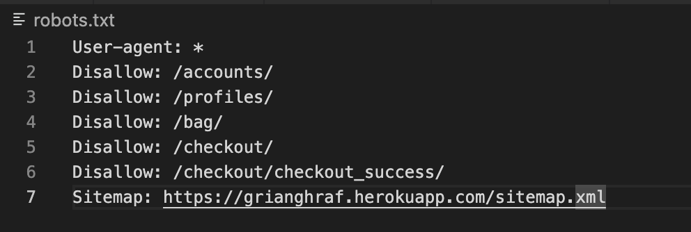<br>

### Sitemap Google Registration

- To ensure that the Google engine will check the website sitemap file I have registered the grianghrad URL on the Google Search Console.

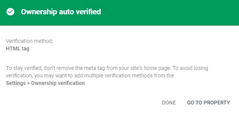<br>


## AWS Setup Process

### AWS S3 Bucket 

The deployed site uses AWS S3 Buckets to store the webpages static and media files. More information on how you can set up an AWS S3 Bucket can be found below:

1. Create an AWS account [here](https://portal.aws.amazon.com/).
2. Login to your account and within the search bar type in "S3".
3. Within the S3 page click on the button that says "Create Bucket".
4. Name the bucket and select the region which is closest to you.
5. Underneath "Object Ownership" select "ACLs enabled".
6. Uncheck "Block Public Access" and acknowledge that the bucket will be made public, then click "Create Bucket".
7. Inside the created bucket click on the "Properties" tab. Below "Static Website Hosting" click "Edit" and change the Static website hosting option to "Enabled". Copy the default values for the index and error documents and click "Save Changes".
8. Click on the "Permissions" tab, below "Cross-origin Resource Sharing (CORS)", click "Edit" and then paste in the following code:

  ```
    [
        {
            "AllowedHeaders": [
            "Authorization"
            ],
            "AllowedMethods": [
            "GET"
            ],
            "AllowedOrigins": [
            "*"
            ],
            "ExposeHeaders": []
        }
    ]
  ```

9. Within the "Bucket Policy" section. Click "Edit" and then "Policy Generator". Click the "Select Type of Policy" dropdown and select "S3 Bucket Policy" and within "Principle" allow all principals by typing "*".
10. Within the "Actions" dropdown menu select "Get Object" and in the previous tab copy the "Bucket ARN number". Paste this within the policy generator within the field labelled "Amazon Resource Name (ARN)".
11. Click "Add statement > Generate Policy" and copy the policy that's been generated and paste this into the "Bucket Policy Editor".
12. Before saving, add /* at the end of your "Resource Key", this will allow access to all resources within the bucket.
13. Once saved, scroll down to the "Access Control List (ACL)" and click "Edit".
14. Next to "Everyone (public access)", check the "list" checkbox and save your changes.

### IAM Set Up

1. Search for IAM within the AWS navigation bar and select it.
2. Click "User Groups" that can be seen in the side bar and then click "Create group" and name the group 'manage-your-project-name'.
3. Click "Policies" and then "Create policy".
4. Navigate to the JSON tab and click "Import Managed Policy", within here search "S3" and select "AmazonS3FullAccess" followed by "Import".
5. Navigate back to the recently created S3 bucket and copy your "ARN Number". Go back to "This Policy" and update the "Resource Key" to include your ARN Number, and another line with your ARN followed by a "/*".
   
- Below is an example of what this should look like:

```
{
    "Version": "2012-10-17",
    "Statement": [
        {
            "Effect": "Allow",
            "Action": [
                "s3:*",
                "s3-object-lambda:*"
            ],
            "Resource": [
                "YOUR-ARN-NO-HERE",
                "YOUR-ARN-NO-HERE/*"
            ]
        }
    ]
}

```

1. Ensure the policy has been given a name and a short description, then click "Create Policy".
2. Click "User groups", and then the group you created earlier. Under permissions click "Add Permission" and from the dropdown click "Attach Policies".
3. Select "Users" from the sidebar and click "Add User".
4. Provide a username and check "Programmatic Access", then click 'Next: Permissions'.
5. Ensure your policy is selected and navigate through until you click "Add User".
6. Download the "CSV file", which contains the user's access key and secret access key.


### Connecting AWS to the Project

1. Within your terminal install the following packages by typing 

```
  pip3 install boto3
  pip3 install django-storages 
```  

2. Freeze the requirements by typing:

```
pip3 freeze > requirements.txt
```

3. Add "storages" to your installed apps within your settings.py file.
4. At the bottom of the settings.py file add the following code:

```
if 'USE_AWS' in os.environ:
    AWS_STORAGE_BUCKET_NAME = 'insert-bucket-name-here'
    AWS_S3_REGION_NAME = 'insert-your-region-here'
    AWS_ACCESS_KEY_ID = os.environ.get('AWS_ACCESS_KEY_ID')
    AWS_SECRET_ACCESS_KEY = os.environ.get('AWS_SECRET_ACCESS_KEY')
```
5. Add the following keys within Heroku: "AWS_ACCESS_KEY_ID" and "AWS_SECRET_ACCESS_KEY". These can be found in your CSV file.
6. Add the key "USE_AWS", and set the value to True within Heroku.
6. Remove the "DISABLE_COLLECTSTAIC" variable from Heroku.
7. Within your settings.py file inside the code just written add: 

```
  AWS_S3_CUSTOM_DOMAIN = f"{AWS_STORAGE_BUCKET_NAME}.s3.amazonaws.com"
```
8. Inside the settings.py file inside the bucket config if statement add the following lines of code:

```
STATICFILES_STORAGE = 'custom_storages.StaticStorage'
STATICFILES_LOCATION = 'static'
DEFAULT_FILE_STORAGE = 'custom_storages.MediaStorage'
MEDIAFILES_LOCATION = 'media'

STATIC_URL = f'https://{AWS_S3_CUSTOM_DOMAIN}/{STATICFILES_LOCATION}/'
MEDIA_URL = f'https://{AWS_S3_CUSTOM_DOMAIN}/{MEDIAFILES_LOCATION}/'

AWS_S3_OBJECT_PARAMETERS = {
    'Expires': 'Thu, 31 Dec 2099 20:00:00 GMT',
    'CacheControl': 'max-age=94608000',
}
```

9. In the root directory of your project create a file called "custom_storages.py". Import the following at the top of this file and add the classes below:

```
  from django.conf import settings
  from storages.backends.s3boto3 import S3Boto3Storage

  class StaticStorage(S3Boto3Storage):
    location = settings.STATICFILES_LOCATION

  class MediaStorage(S3Boto3Storage):
    location = settings.MEDIAFILES_LOCATION
```

10. Navigate back to you AWS S3 Bucket and click on "Create Folder" name this folder "media", within the media file click "Upload > Add Files" and select the images for your site.
11. Under "Permissions" select the option "Grant public-read access" and click "Upload".


## Stripe Payments

- The Stripe payments system is set up as the online payment processing and credit card processing platform for the purchases. 
You will need a stripe account which you can sign up for [here](https://stripe.com/en-ie)

### Payments 
- To set up stripe payments you can follow their guid [here](https://stripe.com/docs/payments/accept-a-payment#web-collect-card-details)

### Webhooks

1. To set up a webhook, sign into your stripe account and click 'Developers' located in the top right of the navbar.
2. Then in the side-nav under the Developers title, click on "Webhooks", then "Add endpoint".
3. On the next page you will need to input the link to your heroku app followed by /checkout/wh/. It should look something like this:
   
    ```
    https://your-app-name.herokuapp.com/checkout/wh/
    ```

4. Then click "+ Select events" and check the "Select all events" checkbox at the top before clicking "Add events" at the bottom. Once this is done finish the form by clicking "Add endpoint".
5. Your webhook is now created and you should see that it has generated a secret key. You will need this to add to your heroku config vars.
6. Head over to your app in heroku and navigate to the config vars section under settings. You will need the secret key you just generated for your webhook, in addition to your Publishable key and secret key that you can find in the API keys section back in stripe.
7. Add these values under these keys:
   
    ```
    STRIPE_PUBLIC_KEY = 'insert your stripe publishable key'
    STRIPE_SECRET_KEY = 'insert your secret key'
    STRIPE_WH_SECRET = 'insert your webhooks secret key'

    ```
8. Finally, back in your settings.py file in django, insert the following near the bottom of the file:  
    ```
    STRIPE_PUBLIC_KEY = os.getenv('STRIPE_PUBLIC_KEY', '')
    STRIPE_SECRET_KEY = os.getenv('STRIPE_SECRET_KEY', '')
    STRIPE_WH_SECRET = os.getenv('STRIPE_WH_SECRET', '')
    ```
- Below is a screenshot of the Watches & Clocks - Stripe dashboard.

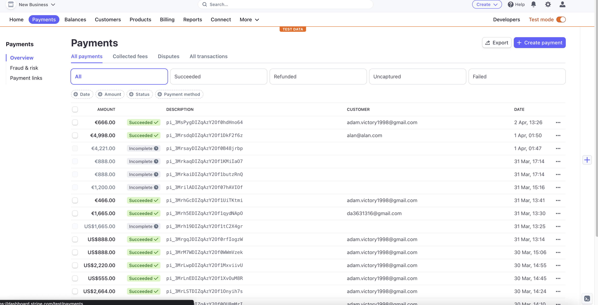<br>


### Technologies Used 

### Languages Used

- [HTML 5](https://en.wikipedia.org/wiki/HTML/)
- [CSS 3](https://en.wikipedia.org/wiki/CSS)
- [JavaScript](https://www.javascript.com/)
- [Django](https://www.python.org/)
- [Python](https://www.djangoproject.com/)<br>

### Django Packages

- [Gunicorn](https://gunicorn.org/) as the server for Heroku
- [Dj_database_url](https://pypi.org/project/dj-database-url/) to parse the database URL from the environment variables in Heroku
- [Psycopg2](https://pypi.org/project/psycopg2/) as an adaptor for Python and PostgreSQL databases
- [Summernote](https://summernote.org/) as a text editor
- [Allauth](https://django-allauth.readthedocs.io/en/latest/installation.html) for authentication, registration and account management
- [Stripe](https://pypi.org/project/stripe/) for processing all online and credit card purchases on the website
- [Crispy Forms](https://django-crispy-forms.readthedocs.io/en/latest/) to style the forms
- [Pillow](https://pypi.org/project/Pillow/) to process and save all the images downloaded through the database<br>

* Python 
    * The following modules were used: 
      * asgiref==3.6.0
      * boto3==1.26.100
      * botocore==1.29.100
      * dj-database-url==0.5.0
      * Django==3.2
      * django-allauth==0.41.0
      * django-contact-form==2.0.1
      * django-countries==7.2.1
      * django-crispy-forms==1.14.0
      * django-storages==1.13.2
      * django-summernote==0.8.20.0
      * gunicorn==20.1.0
      * jmespath==1.0.1
      * oauthlib==3.2.2
      * Pillow==9.4.0
      * psycopg2==2.9.5
      * PyJWT==2.6.0
      * python3-openid==3.2.0
      * pytz==2022.7.1
      * requests-oauthlib==1.3.1
      * s3transfer==0.6.0
      * sqlparse==0.4.3
      * stripe==5.2.0


* Django 
    * Django has been used as the main framweork for this full stack project. 
    * Django AllAuth has been used for user authentication. 

    <br>

* Heroku - To deploy project
* ElephantSQL - Database for project
* Bootstrap - For styling of CSS/JS
* Django templating - main framework
* Figma - creating wireframes, flowchart and database schema. 
* Font Awesome - icons 
* Gitpod - Create/edit code
* GitHub - Repository to store code 
* Google Fonts - fonts for text 
* Coolers - choose colour palette
* DevTools - assist development
* WAVE - To test accessibility 
* PEP8 - To test python code
* JShint - To test JavaScript
* Jigsaw - To test CSS
* Validator - To test HTML code 
* Favicon.io - To create different favicon sizes. 
* AWS - host static files and media. 

### Testing

Testing results are [here](TESTING.md)

[TESTING.md](TESTING.md) file

### Creating the Django app

1. Go to the Code Institute Gitpod Full Template Template
2. Click on Use This Template
3. Once the template is available in your repository click on Gitpod
4. When the image for the template and the Gitpod are ready open a new terminal to start a new Django App
5. Install Django and gunicorn: pip3 install django gunicorn
6. Install supporting database libraries dj_database_url and psycopg2 library: pip3 install dj_database_url psycopg2
7. Create file for requirements: in the terminal window type pip freeze --local > requirements.txt
8. Create project: in the terminal window type django-admin startproject your_project_name
9. Create app: in the terminal window type python3 manage.py startapp your_app_name
10. Add app to the list of installed apps in settings.py file: you_app_name
11. Migrate changes: in the terminal window type python3 manage.py migrate
12. Run the server to test if the app is installed, in the terminal "The install worked successfully! Congratulations!"


### Deployment of This Project

* This site was deployed by completing the following steps:

1. Log in to Heroku or create an account
2. On the main page click the button labelled New in the top right corner and from the drop-down menu select Create New App
3. You must enter a unique app name
4. Next select your region
5. Click on the Create App button
6. Click in resources and select Heroku Postgres database
7. Click Reveal Config Vars and add:
* A new record with SECRET_KEY
* A new record with the AWS_ACCESS_KEY_ID
* A new record with the AWS_SECRET_ACCESS_KEY
* A new record with the EMAIL_HOST_PASS
* A new record with the EMAIL_HOST_USER
* A new record with the STRIPE_PUBLIC_KEY
* A new record with the STRIPE_SECRET_KEY
* A new record with the STRIPE_WH_SECRET
* A new record with the DISABLE_COLLECTSTATIC = 1

8. The next page is the project’s Deploy Tab. Click on the Settings Tab and scroll down to Config Vars
9. Next, scroll down to the Buildpack section click Add Buildpack select python and click Save Changes
10. Scroll to the top of the page and choose the Deploy tab
11. Select Github as the deployment method
12. Confirm you want to connect to GitHub
13. Search for the repository name and click the connect button
14. Scroll to the bottom of the deploy page and select the preferred deployment type
15. Click Enable Automatic Deploys for automatic deployment when you push updates to Github


### Final Deployment

1. Create a runtime.txt "python-3.9.13"
2. Create a Procfile "web: gunicorn your_project_name.wsgi"
3. When development is complete change the debug setting to: DEBUG = False in settings.py
4. In this project the summernote editor was used so for this to work in Heroku add: X_FRAME_OPTIONS = 'SAMEORIGIN' to settings.py.
5. In Heroku settings config vars delete the record for DISABLE_COLLECTSTATIC
6. In Heroku settings config vars set the record for USE_AWS to True


### Forking This Project

* Fork this project by following the steps:

1. Open GitHub
2. Find the "Fork" button at the top right of the page
3. Once you click the button the fork will be in your repository

### Cloning this project

* Clone this project by following the steps:

1. Open GitHub
2. You will be provided with three options to choose from, HTTPS, SSH or GitHub CLI, click the clipboard icon in order to copy the URL
3. Once you click the button the fork will be in your repository
4. Open a new terminal
5. Change the current working directory to the location that you want the cloned directory
6. Type "git clone" and paste the URL copied in step 3
7. Press "Enter" and the project is cloned


### Information Sources / Resources

* W3Schools - Python
* Stack Overflow
* Scrimba - Pyhton
* Code Institute - Slack Community


### Credits 

* Code Institute's Boutique Ado walkthrough. 
* Conns Cameras for the imagery. 


